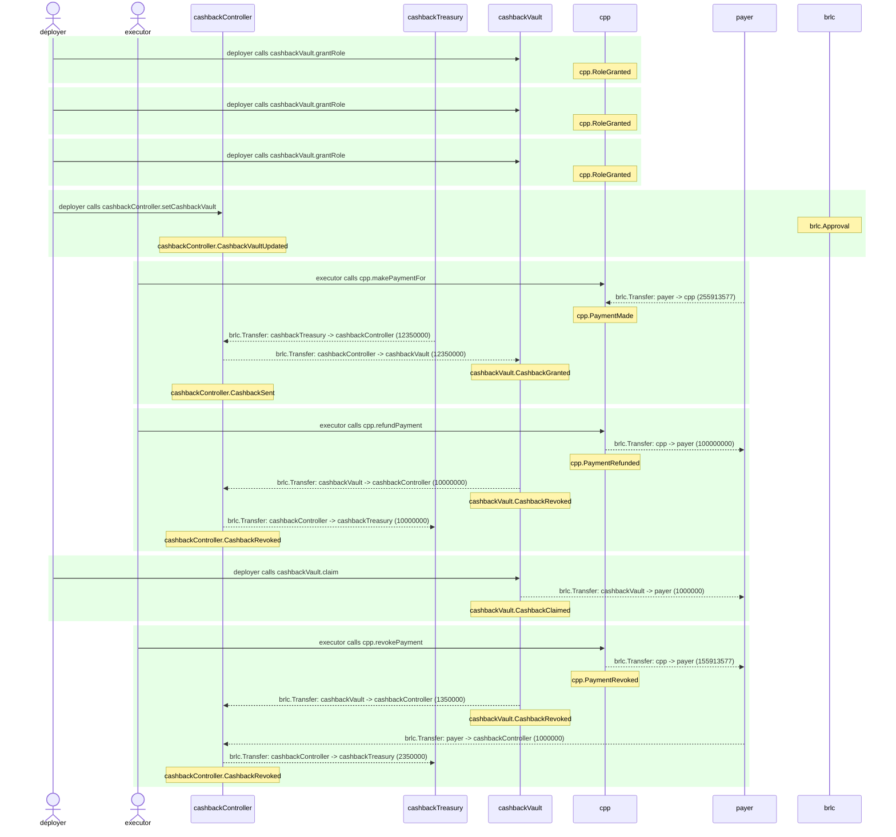

# CardPaymentProcessor.test

## Contract 'CardPaymentProcessor' with CashbackController hook connected > Scenarios > CC and CV scenarios

| Idx | Caller | Contract | Name | Args |
| --- | ------ | -------- | ---- | ---- |
| 1 | deployer | cashbackVault | grantRole | [0xd10feaa7..70c5af57cf, deployer] |
| 2 | deployer | cashbackVault | grantRole | [0xb9c949ce..0c572ffcc2, cashbackController] |
| 3 | deployer | cashbackVault | grantRole | [0x241ecf16..7caa831b08, deployer] |
| 4 | deployer | cashbackController | setCashbackVault | [cashbackVault] |
| 5 | executor | cpp | makePaymentFor | [0x00000000..0000000001, payer, 123456789, 132456788, ZERO_ADDR, 0, -1, 0] |
| 6 | executor | cpp | refundPayment | [0x00000000..0000000001, 100000000] |
| 7 | deployer | cashbackVault | claim | [payer, 1000000] |
| 8 | executor | cpp | revokePayment | [0x00000000..0000000001] |

Step 0: cashbackVault.grantRole

- **type**: methodCall
- **caller**: deployer
- **args**: `{
  "role": "0xd10feaa7..70c5af57cf",
  "account": "deployer"
}`

**Events**

| # | Contract | Event | Args |
| - | -------- | ----- | ---- |
| 1 | cpp | RoleGranted | `[0xd10feaa7..70c5af57cf, deployer, deployer]` |

**Balances**

**Token:** brlc
| Holder | Balance |
| ------ | ------- |
| cpp | 0 |
| cashbackVault | 0 |
| cashbackController | 0 |
| brlc | 0 |
| payer | 1000000000000 |
| deployer | 0 |
| executor | 0 |
| sponsor | 2000000000000 |
| cashbackTreasury | 57896044618658097711785492504343953926634992332820282019728792003956564819967 |
| cashOutAccount | 0 |

Step 1: cashbackVault.grantRole

- **type**: methodCall
- **caller**: deployer
- **args**: `{
  "role": "0xb9c949ce..0c572ffcc2",
  "account": "cashbackController"
}`

**Events**

| # | Contract | Event | Args |
| - | -------- | ----- | ---- |
| 1 | cpp | RoleGranted | `[0xb9c949ce..0c572ffcc2, cashbackController, deployer]` |

**Balances**

**Token:** brlc
| Holder | Balance |
| ------ | ------- |
| cpp | 0 |
| cashbackVault | 0 |
| cashbackController | 0 |
| brlc | 0 |
| payer | 1000000000000 |
| deployer | 0 |
| executor | 0 |
| sponsor | 2000000000000 |
| cashbackTreasury | 57896044618658097711785492504343953926634992332820282019728792003956564819967 |
| cashOutAccount | 0 |

Step 2: cashbackVault.grantRole

- **type**: methodCall
- **caller**: deployer
- **args**: `{
  "role": "0x241ecf16..7caa831b08",
  "account": "deployer"
}`

**Events**

| # | Contract | Event | Args |
| - | -------- | ----- | ---- |
| 1 | cpp | RoleGranted | `[0x241ecf16..7caa831b08, deployer, deployer]` |

**Balances**

**Token:** brlc
| Holder | Balance |
| ------ | ------- |
| cpp | 0 |
| cashbackVault | 0 |
| cashbackController | 0 |
| brlc | 0 |
| payer | 1000000000000 |
| deployer | 0 |
| executor | 0 |
| sponsor | 2000000000000 |
| cashbackTreasury | 57896044618658097711785492504343953926634992332820282019728792003956564819967 |
| cashOutAccount | 0 |

Step 3: cashbackController.setCashbackVault

- **type**: methodCall
- **caller**: deployer
- **args**: `{
  "cashbackVault": "cashbackVault"
}`

**Events**

| # | Contract | Event | Args |
| - | -------- | ----- | ---- |
| 1 | brlc | Approval | `[cashbackController, cashbackVault, 1157920892..3129639935]` |
| 2 | cashbackController | CashbackVaultUpdated | `[cashbackVault]` |

**Balances**

**Token:** brlc
| Holder | Balance |
| ------ | ------- |
| cpp | 0 |
| cashbackVault | 0 |
| cashbackController | 0 |
| brlc | 0 |
| payer | 1000000000000 |
| deployer | 0 |
| executor | 0 |
| sponsor | 2000000000000 |
| cashbackTreasury | 57896044618658097711785492504343953926634992332820282019728792003956564819967 |
| cashOutAccount | 0 |

Step 4: cpp.makePaymentFor

- **type**: methodCall
- **caller**: executor
- **args**: `{
  "paymentId": "0x00000000..0000000001",
  "payer": "payer",
  "baseAmount": "123456789",
  "extraAmount": "132456788",
  "sponsor": "ZERO_ADDR",
  "subsidyLimit": "0",
  "cashbackRate_": "-1",
  "confirmationAmount": "0"
}`

**Events**

| # | Contract | Event | Args |
| - | -------- | ----- | ---- |
| 1 | brlc | Transfer | `[payer, cpp, 255913577]` |
| 2 | cpp | PaymentMade | `[0x00000000..0000000001, payer, 0x01000000..000f40ee69]` |
| 3 | brlc | Transfer | `[cashbackTreasury, cashbackController, 12350000]` |
| 4 | brlc | Transfer | `[cashbackController, cashbackVault, 12350000]` |
| 5 | cashbackVault | CashbackGranted | `[payer, cashbackController, 12350000, 12350000]` |
| 6 | cashbackController | CashbackSent | `[0x00000000..0000000001, payer, 1, 12350000]` |

**Balances**

**Token:** brlc
| Holder | Balance |
| ------ | ------- |
| cpp | 255913577 |
| cashbackVault | 12350000 |
| cashbackController | 0 |
| brlc | 0 |
| payer | 999744086423 |
| deployer | 0 |
| executor | 0 |
| sponsor | 2000000000000 |
| cashbackTreasury | 57896044618658097711785492504343953926634992332820282019728792003956552469967 |
| cashOutAccount | 0 |

Step 5: cpp.refundPayment

- **type**: methodCall
- **caller**: executor
- **args**: `{
  "paymentId": "0x00000000..0000000001",
  "refundingAmount": "100000000"
}`

**Events**

| # | Contract | Event | Args |
| - | -------- | ----- | ---- |
| 1 | brlc | Transfer | `[cpp, payer, 100000000]` |
| 2 | cpp | PaymentRefunded | `[0x00000000..0000000001, payer, 0x01000000..0005f5e100]` |
| 3 | brlc | Transfer | `[cashbackVault, cashbackController, 10000000]` |
| 4 | cashbackVault | CashbackRevoked | `[payer, cashbackController, 10000000, 2350000]` |
| 5 | brlc | Transfer | `[cashbackController, cashbackTreasury, 10000000]` |
| 6 | cashbackController | CashbackRevoked | `[0x00000000..0000000001, payer, 1, 12350000, 2350000]` |

**Balances**

**Token:** brlc
| Holder | Balance |
| ------ | ------- |
| cpp | 155913577 |
| cashbackVault | 2350000 |
| cashbackController | 0 |
| brlc | 0 |
| payer | 999844086423 |
| deployer | 0 |
| executor | 0 |
| sponsor | 2000000000000 |
| cashbackTreasury | 57896044618658097711785492504343953926634992332820282019728792003956562469967 |
| cashOutAccount | 0 |

Step 6: cashbackVault.claim

- **type**: methodCall
- **caller**: deployer
- **args**: `{
  "account": "payer",
  "amount": "1000000"
}`

**Events**

| # | Contract | Event | Args |
| - | -------- | ----- | ---- |
| 1 | brlc | Transfer | `[cashbackVault, payer, 1000000]` |
| 2 | cashbackVault | CashbackClaimed | `[payer, deployer, 1000000, 1350000]` |

**Balances**

**Token:** brlc
| Holder | Balance |
| ------ | ------- |
| cpp | 155913577 |
| cashbackVault | 1350000 |
| cashbackController | 0 |
| brlc | 0 |
| payer | 999845086423 |
| deployer | 0 |
| executor | 0 |
| sponsor | 2000000000000 |
| cashbackTreasury | 57896044618658097711785492504343953926634992332820282019728792003956562469967 |
| cashOutAccount | 0 |

Step 7: cpp.revokePayment

- **type**: methodCall
- **caller**: executor
- **args**: `{
  "paymentId": "0x00000000..0000000001"
}`

**Events**

| # | Contract | Event | Args |
| - | -------- | ----- | ---- |
| 1 | brlc | Transfer | `[cpp, payer, 155913577]` |
| 2 | cpp | PaymentRevoked | `[0x00000000..0000000001, payer, 0x01000000..00094b0d69]` |
| 3 | brlc | Transfer | `[cashbackVault, cashbackController, 1350000]` |
| 4 | cashbackVault | CashbackRevoked | `[payer, cashbackController, 1350000, 0]` |
| 5 | brlc | Transfer | `[payer, cashbackController, 1000000]` |
| 6 | brlc | Transfer | `[cashbackController, cashbackTreasury, 2350000]` |
| 7 | cashbackController | CashbackRevoked | `[0x00000000..0000000001, payer, 1, 2350000, 0]` |

**Balances**

**Token:** brlc
| Holder | Balance |
| ------ | ------- |
| cpp | 0 |
| cashbackVault | 0 |
| cashbackController | 0 |
| brlc | 0 |
| payer | 1000000000000 |
| deployer | 0 |
| executor | 0 |
| sponsor | 2000000000000 |
| cashbackTreasury | 57896044618658097711785492504343953926634992332820282019728792003956564819967 |
| cashOutAccount | 0 |

