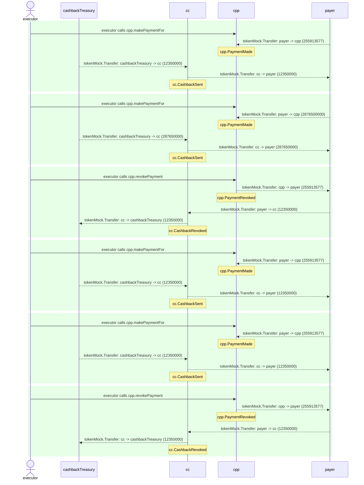

# CardPaymentProcessor.test

## Contract 'CardPaymentProcessor' with CashbackController hook connected > Scenario with cashback periodic cap > Executes as expected

| Idx | Caller | Contract | Name | Args |
| --- | ------ | -------- | ---- | ---- |
| 1 | executor | cpp |  | [0x00000000..0000000001, payer, 123456789, 132456788, ZERO_ADDR, 0, -1, 0] |
| 2 | executor | cpp |  | [0x15329664..b9b784b10e, payer, 2876500000, 0, ZERO_ADDR, 0, -1, 0] |
| 3 | executor | cpp |  | [0x00000000..0000000001] |
| 4 | executor | cpp |  | [0x00000000..0000000001, payer, 123456789, 132456788, ZERO_ADDR, 0, -1, 0] |
| 5 | executor | cpp |  | [0x00000000..0000000002, payer, 123456789, 132456788, ZERO_ADDR, 0, -1, 0] |
| 6 | executor | cpp |  | [0x00000000..0000000001] |

Step 0: cpp.makePaymentFor

- **type**: methodCall
- **caller**: executor
- **args**: `{
  "paymentId": "0x00000000..0000000001",
  "payer": "payer",
  "baseAmount": "123456789",
  "extraAmount": "132456788",
  "sponsor": "ZERO_ADDR",
  "subsidyLimit": "0",
  "cashbackRate_": "-1",
  "confirmationAmount": "0"
}`

**Events**

| # | Contract | Event | Args |
| - | -------- | ----- | ---- |
| 1 | tokenMock | Transfer | `[payer, cpp, 255913577]` |
| 2 | cpp | PaymentMade | `[0x00000000..0000000001, payer, 0x01000000..000f40ee69]` |
| 3 | tokenMock | Transfer | `[cashbackTreasury, cc, 12350000]` |
| 4 | tokenMock | Transfer | `[cc, payer, 12350000]` |
| 5 | cc | CashbackSent | `[0x00000000..0000000001, payer, 1, 12350000]` |

**Balances**

**Token:** tokenMock
| Holder | Balance |
| ------ | ------- |
| cpp | 255913577 |
| cc | 0 |
| tokenMock | 0 |
| payer | 999756436423 |
| cashbackTreasury | 57896044618658097711785492504343953926634992332820282019728792003956552469967 |
| cashOutAccount | 0 |
| deployer | 0 |
| executor | 0 |

Step 1: cpp.makePaymentFor

- **type**: methodCall
- **caller**: executor
- **args**: `{
  "paymentId": "0x15329664..b9b784b10e",
  "payer": "payer",
  "baseAmount": "2876500000",
  "extraAmount": "0",
  "sponsor": "ZERO_ADDR",
  "subsidyLimit": "0",
  "cashbackRate_": "-1",
  "confirmationAmount": "0"
}`

**Events**

| # | Contract | Event | Args |
| - | -------- | ----- | ---- |
| 1 | tokenMock | Transfer | `[payer, cpp, 2876500000]` |
| 2 | cpp | PaymentMade | `[0x15329664..b9b784b10e, payer, 0x01000000..00ab73e820]` |
| 3 | tokenMock | Transfer | `[cashbackTreasury, cc, 287650000]` |
| 4 | tokenMock | Transfer | `[cc, payer, 287650000]` |
| 5 | cc | CashbackSent | `[0x15329664..b9b784b10e, payer, 1, 287650000]` |

**Balances**

**Token:** tokenMock
| Holder | Balance |
| ------ | ------- |
| cpp | 3132413577 |
| cc | 0 |
| tokenMock | 0 |
| payer | 997167586423 |
| cashbackTreasury | 57896044618658097711785492504343953926634992332820282019728792003956264819967 |
| cashOutAccount | 0 |
| deployer | 0 |
| executor | 0 |

Step 2: cpp.revokePayment

- **type**: methodCall
- **caller**: executor
- **args**: `{
  "paymentId": "0x00000000..0000000001"
}`

**Events**

| # | Contract | Event | Args |
| - | -------- | ----- | ---- |
| 1 | tokenMock | Transfer | `[cpp, payer, 255913577]` |
| 2 | cpp | PaymentRevoked | `[0x00000000..0000000001, payer, 0x01000000..000f40ee69]` |
| 3 | tokenMock | Transfer | `[payer, cc, 12350000]` |
| 4 | tokenMock | Transfer | `[cc, cashbackTreasury, 12350000]` |
| 5 | cc | CashbackRevoked | `[0x00000000..0000000001, payer, 1, 12350000, 0]` |

**Balances**

**Token:** tokenMock
| Holder | Balance |
| ------ | ------- |
| cpp | 2876500000 |
| cc | 0 |
| tokenMock | 0 |
| payer | 997411150000 |
| cashbackTreasury | 57896044618658097711785492504343953926634992332820282019728792003956277169967 |
| cashOutAccount | 0 |
| deployer | 0 |
| executor | 0 |

Step 3: cpp.makePaymentFor

- **type**: methodCall
- **caller**: executor
- **args**: `{
  "paymentId": "0x00000000..0000000001",
  "payer": "payer",
  "baseAmount": "123456789",
  "extraAmount": "132456788",
  "sponsor": "ZERO_ADDR",
  "subsidyLimit": "0",
  "cashbackRate_": "-1",
  "confirmationAmount": "0"
}`

**Events**

| # | Contract | Event | Args |
| - | -------- | ----- | ---- |
| 1 | tokenMock | Transfer | `[payer, cpp, 255913577]` |
| 2 | cpp | PaymentMade | `[0x00000000..0000000001, payer, 0x01000000..000f40ee69]` |
| 3 | tokenMock | Transfer | `[cashbackTreasury, cc, 12350000]` |
| 4 | tokenMock | Transfer | `[cc, payer, 12350000]` |
| 5 | cc | CashbackSent | `[0x00000000..0000000001, payer, 1, 12350000]` |

**Balances**

**Token:** tokenMock
| Holder | Balance |
| ------ | ------- |
| cpp | 3132413577 |
| cc | 0 |
| tokenMock | 0 |
| payer | 997167586423 |
| cashbackTreasury | 57896044618658097711785492504343953926634992332820282019728792003956264819967 |
| cashOutAccount | 0 |
| deployer | 0 |
| executor | 0 |

Step 4: cpp.makePaymentFor

- **type**: methodCall
- **caller**: executor
- **args**: `{
  "paymentId": "0x00000000..0000000002",
  "payer": "payer",
  "baseAmount": "123456789",
  "extraAmount": "132456788",
  "sponsor": "ZERO_ADDR",
  "subsidyLimit": "0",
  "cashbackRate_": "-1",
  "confirmationAmount": "0"
}`

**Events**

| # | Contract | Event | Args |
| - | -------- | ----- | ---- |
| 1 | tokenMock | Transfer | `[payer, cpp, 255913577]` |
| 2 | cpp | PaymentMade | `[0x00000000..0000000002, payer, 0x01000000..000f40ee69]` |
| 3 | tokenMock | Transfer | `[cashbackTreasury, cc, 12350000]` |
| 4 | tokenMock | Transfer | `[cc, payer, 12350000]` |
| 5 | cc | CashbackSent | `[0x00000000..0000000002, payer, 1, 12350000]` |

**Balances**

**Token:** tokenMock
| Holder | Balance |
| ------ | ------- |
| cpp | 3388327154 |
| cc | 0 |
| tokenMock | 0 |
| payer | 996924022846 |
| cashbackTreasury | 57896044618658097711785492504343953926634992332820282019728792003956252469967 |
| cashOutAccount | 0 |
| deployer | 0 |
| executor | 0 |

Step 5: cpp.revokePayment

- **type**: methodCall
- **caller**: executor
- **args**: `{
  "paymentId": "0x00000000..0000000001"
}`

**Events**

| # | Contract | Event | Args |
| - | -------- | ----- | ---- |
| 1 | tokenMock | Transfer | `[cpp, payer, 255913577]` |
| 2 | cpp | PaymentRevoked | `[0x00000000..0000000001, payer, 0x01000000..000f40ee69]` |
| 3 | tokenMock | Transfer | `[payer, cc, 12350000]` |
| 4 | tokenMock | Transfer | `[cc, cashbackTreasury, 12350000]` |
| 5 | cc | CashbackRevoked | `[0x00000000..0000000001, payer, 1, 12350000, 0]` |

**Balances**

**Token:** tokenMock
| Holder | Balance |
| ------ | ------- |
| cpp | 3132413577 |
| cc | 0 |
| tokenMock | 0 |
| payer | 997167586423 |
| cashbackTreasury | 57896044618658097711785492504343953926634992332820282019728792003956264819967 |
| cashOutAccount | 0 |
| deployer | 0 |
| executor | 0 |

